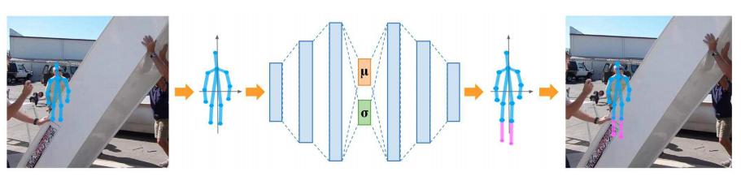

# Fiiling the Gap
[[Paper]](https://openaccess.thecvf.com/content_ECCVW_2018/papers/11130/Carissimi_Filling_the_Gaps_Predicting_Missing_Joints_of_Human_Poses_Using_ECCVW_2018_paper.pdf)

- Filling the Gap implementation on pytorch Frameworks.
- for testing that this model can resolve **human-background occlusion.**

  

---

### Todo
- [x] Implementing model
- [x] Implementing Augmentation
- [ ] Training on MPII dataset 
- [ ] Campare the result with Original Ref

