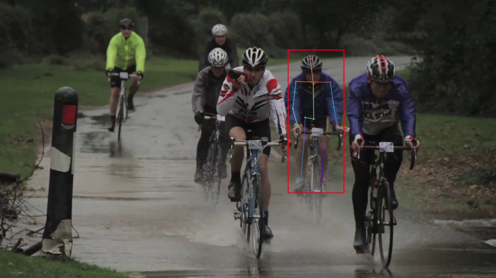
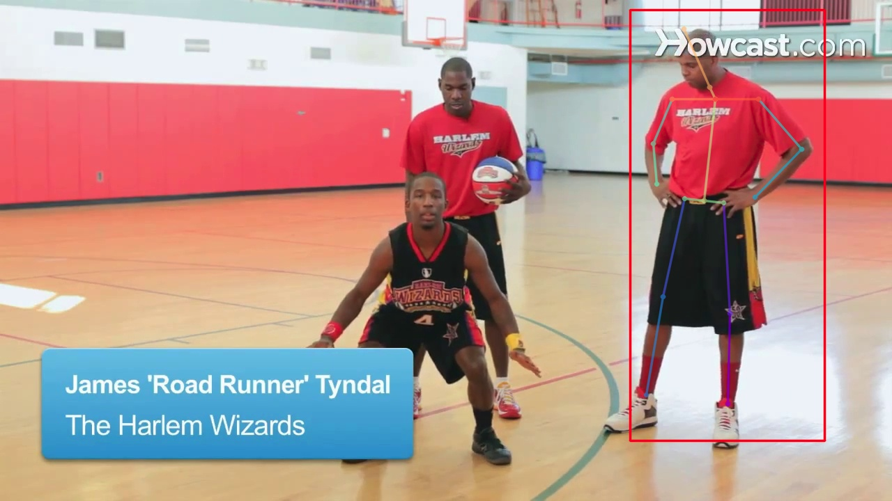

# Fiiling the Gap
- Filling the Gap implementation on pytorch Frameworks.
- for testing that this model can resolve **human-background occlusion.**
  
  

#### [문제]
- PoseFix를 시도해 봤지만 생각보다 결과가 좋지 않았고 실제 daram에 얹었을 때는 상대적으로 느린 속도 보여주었음
- 사람-배경 occlusion은 결국 missing joints를 얼마나 잘 극복하느냐에 달렸음 → `자료 조사 중 VAE로 극복이 가능하다는 논문 발견했고 시도해 보기로 결정`
  

#### [개요]
- [[Paper]](https://openaccess.thecvf.com/content_ECCVW_2018/papers/11130/Carissimi_Filling_the_Gaps_Predicting_Missing_Joints_of_Human_Poses_Using_ECCVW_2018_paper.pdf)
- `VAE`를 사용해서 `coordinates 자체를 correction`해주는 방법
- `학습이 Fully jointed데이터에서만 가능`하다 → 하지만 Coco 데이터셋의 경우는 17개의 joints가 모두 있는 경우가 너무 작다 → 충분한 학습이 불가능하기 때문에 논문에서는 MPII 데이터셋으로 학습한다.
- 코딩을 하다보니 MPII 데이터셋과 Coco데이터셋의 annotation이 달라서 해당 방법의 효용성에 의문이 생김 → 논문에서는 `head, upper neck, thorax, pelvis와 같은 coco에서는 없는 포인트 들을 0으로 세팅하고 돌리면 된다`라고 나오는데 이게 과연 진짜 joint가 다를 때에도 확실한 효과를 보이는지 모르겠음

  

#### [학습]
- `학습이 Fully jointed데이터에서만 가능`하다 → 하지만 Coco 데이터셋의 경우는 17개의 joints가 모두 있는 경우가 너무 작다 → 충분한 학습이 불가능하기 때문에 논문에서는 MPII 데이터셋으로 학습한다.
- 코딩을 하다보니 MPII 데이터셋과 Coco데이터셋의 annotation이 달라서 해당 방법의 효용성에 의문이 생김 → 논문에서는 `head, upper neck, thorax, pelvis와 같은 coco에서는 없는 포인트 들을 0으로 세팅하고 돌리면 된다`라고 나오는데 이게 과연 진짜 joint가 다를 때에도 확실한 효과를 보이는지 모르겠음

- 2개의 Hidden layer를 가지는 VAE를 기반으로 학습 시도 해봤음.
    - 논문기반의 모델과 Augmentation을 기반으로 했는데 생각보다 결과가 좋지 않았다...
    - Cost로 `L1Loss와 KL-Divergence`가 있음 → `KLDivergence가 수렴이 되지 않고 계속 증가...`
    - `레이어를 늘려주면 KL-Divergence가 조금 줄어드는 경향이 있으나, L1 Loss가 증가하여 결국은 좋지 않은 결과`가 나온다.
    - 논문 저자는 어떻게 해결을 했는지 모르겠다. → 심지어 Missing point를 넣지 않고 인풋으로 주어도 제대로된 결과를 뱉지 못한다...
- 기타시도
    - β-VAE가 있어서 시도 해봄
        - β라는 계수를 통해 KL-Divergence의 학습에 좀더 높은 가중치를 배분 해준다. → `KL-Divergence의 학습에 도움을 주지만, 전체적인 Cost로 보았을 때는 별로 의미가 없어 보임`
    - ControlVAE를 시도해 봤는데 괄목할 수준의 결과는 아니었음
    - [[LaDDer]](https://arxiv.org/pdf/2009.00088v1.pdf) → VAE에서 u, sigma를 gaussian prior로 매핑하는게 아니라 generative모델을 통해서 만들어주는 신박한 논문  → 테스트는 못해봤음

        ![[LaDDer]](./imgs/LaDDer.png)

#### [평가]
- (어느정도)잘된 케이스
    
    
      

- 이상한 케이스
    
    
      

- daram에 얹어서 돌려본 결과 FPS에 영향을 거의 미치지 않아 동일한 추론속도라 봐도 무방
→ 좋은 결과만 나왔다면 얹어서 사용해볼 만하지만, 논문 상에서 공개하지 않은 숨겨진 포인트가 있다고 판단됨.. 시간이 남는다면 한번 더 테스트해봐도 될거 같음
  
  

### Todo
- [x] Implementing model
- [x] Implementing Augmentation
- [x] Training on MPII dataset 
- [ ] Campare the result with Original Ref

